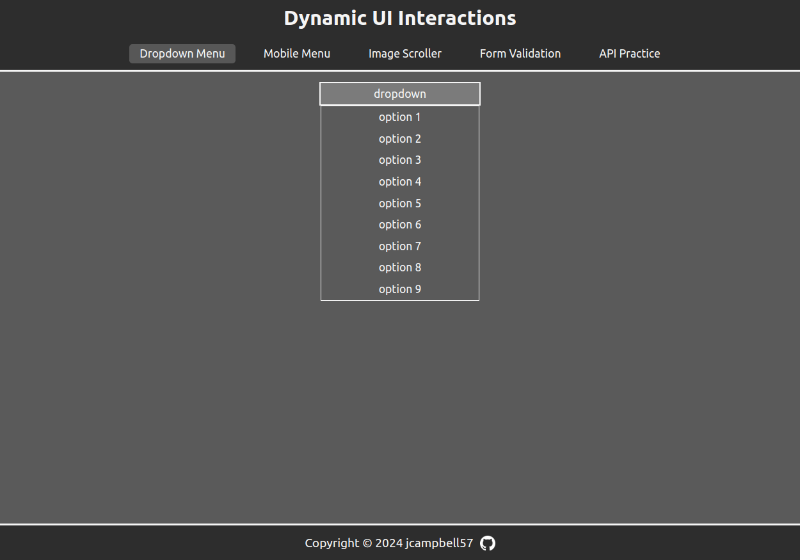
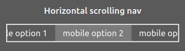
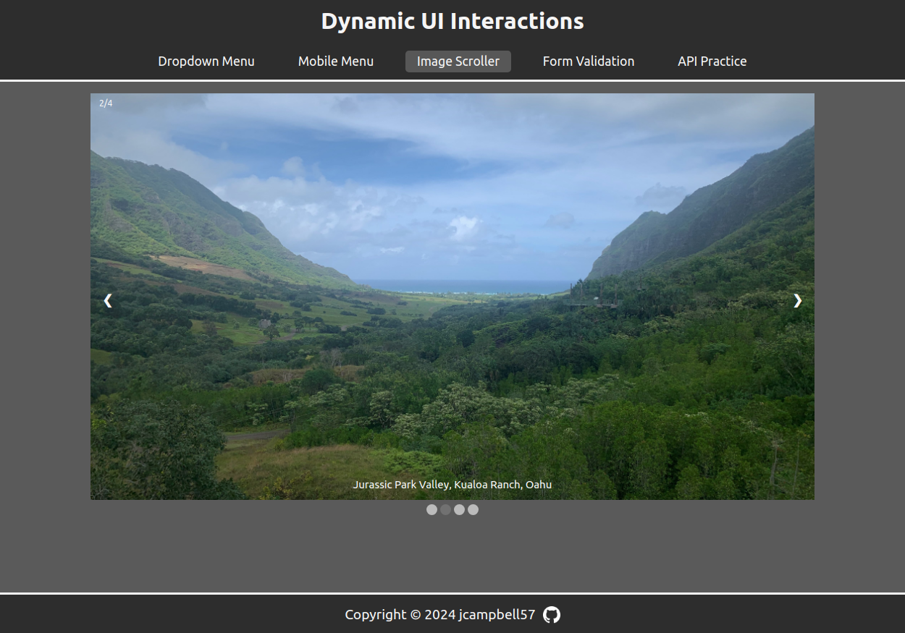
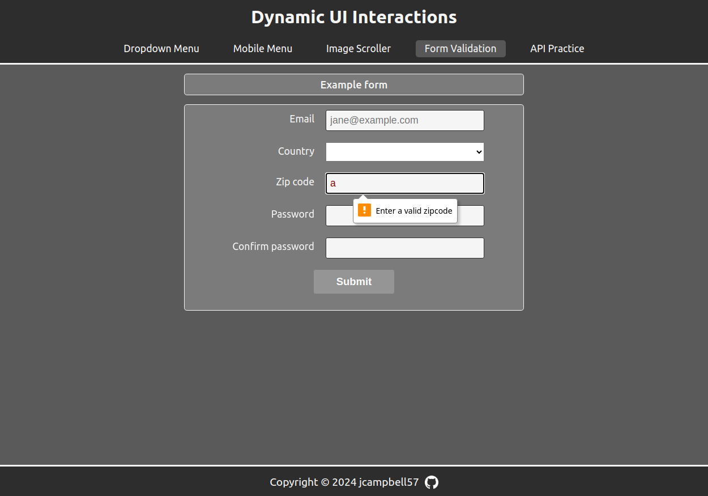
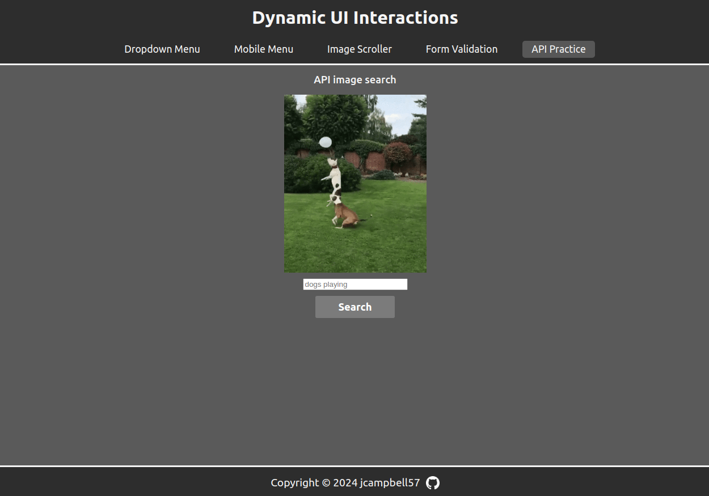

# dynamic-user-interface-interactions

## Project info

This repo features the some of the projects that I completed while working through the javascript module of The Odin Project. These projects served as great practice for me while I was learning the language, and I intend to improve and refer to these examples in the future. I also used this repo as an opportunity to practice implementing webpack, linting and babel.

Project descriptions can be found here:
- https://www.theodinproject.com/lessons/javascript-dynamic-user-interface-interactions
- https://www.theodinproject.com/lessons/javascript-form-validation-with-javascript
- https://www.theodinproject.com/lessons/javascript-working-with-apis

## Live demo

Live demo available [here](https://jcampbell57.github.io/dynamic-user-interface-interactions/)

## Features

- API image search
- Javascript form validation
- Image scroller
- Mobile menu
- Dropdown menu
- Webpack
- Linting
- Babel

## Photos

### Dropdown menu:

 

### Mobile menu:

 

### Image scroller:

 

### Javascript form validation:

 

### API image search:

 

## Resources

- To implement a mobile menu with horizontal scrolling, I referenced this article:
  - https://css-tricks.com/how-to-create-a-horizontally-scrolling-site/

- to make horizontal scrolling functional with the scrollwheel, I referenced this article:
  - https://alvarotrigo.com/blog/scroll-horizontally-with-mouse-wheel-vanilla-java/

- To hide the mobile menu, I referenced this resource: 
  - https://www.w3schools.com/howto/howto_css_hide_scrollbars.asp

- to implement the image scroller, I referenced this resource:
  - https://www.w3schools.com/howto/howto_js_slideshow.asp
